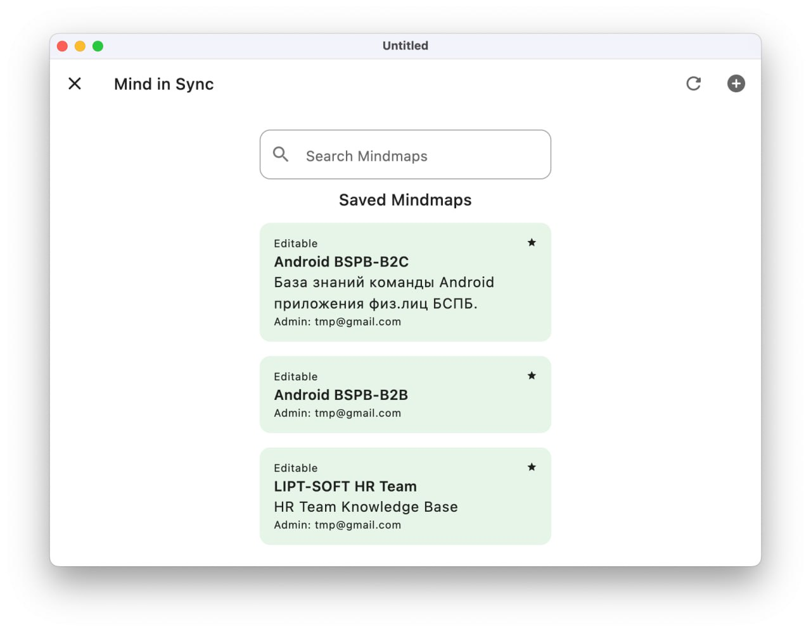

# MIND IN SYNC


---

## Table of Contents

- [Introduction](#introduction)
- [Architecture](#architecture)
- [Features](#features)
- [Screenshots](#Screenshots)
- [Installation](#installation)
- [Usage](#usage)
- [Modules](#modules)

## Introduction

This application is a cross-platform tool designed for educational purposes using connection diagrams based on Kotlin
Compose Multiplatform.

## Architecture

The application follows a modular architecture, separating different concerns into distinct modules. This allows for
better maintainability, scalability, and testability.

### Screenshots

| Screen Name             | Description                                                           | Screenshot                               |
|-------------------------|-----------------------------------------------------------------------|------------------------------------------|
| **Splash Screen**       | First screen of application                                           |      |
| **Login Screen**        | User authentication and login.                                        |        |
| **Catalog Screen**      | Displays the list of available diagrams.                              |    |
| **Map Screen**          | Interface for creating and editing diagrams.                          |            |
| **Details Screen**      | Shows detailed information about a diagram.                           |    |
| **Testing Screen**      | Allows users to take tests based on the content.                      |       |
| **Node Details Screen** | A screen with training material on the selected vertex of the diagram |  |

## Features

- **Cross-Platform**: Available on Android, iOS, and desktop.
- **Connection Diagrams**: Create, edit, and view connection diagrams.
- **Automated AI Test Generation**: Generate tests based on the provided educational content.
- **Progress Tracking**: Track the learning progress of users.
- **Admin Tools**: Manage content and monitor user performance.

## Installation

### Prerequisites

- [Kotlin 1.8+](https://kotlinlang.org/)
- [Android Studio](https://developer.android.com/studio)
- [Xcode](https://developer.apple.com/xcode/) (for iOS development)

### Steps

1. **Clone the repository:**
   ```sh
   git clone https://github.com/MILKA-TOP/KMP-MINDMAP
   cd KMP-MINDMAP
   ```

2. **Open the project in Android Studio:**
   ```sh
   open -a "Android Studio" .
   ```

3. **Sync the project:**
   ```sh
   ./gradlew sync
   ```

## Usage

### Running the Application

For Android:

```sh
cd client
./gradlew installDebug
```

For iOS:
Open the `client/iosApp` directory in Xcode and run the project.

## Modules

The application is divided into the following modules:

| Layer                          | Module    | Description                                                                                                    |
|--------------------------------|-----------|----------------------------------------------------------------------------------------------------------------|
| **UI Layer (Feature modules)** | `Login`   | Manages user authentication and session handling.                                                              |
|                                | `Catalog` | Handles the display and management of available diagrams.                                                      |
|                                | `Map`     | Manages the creation, editing, and viewing of connection diagrams.                                             |
|                                | `Details` | Displays detailed information about diagrams and their nodes.                                                  |
|                                | `Testing` | Manages the generation and completion of tests related to the educational content.                             |
| **Domain Layer**               | `Domain`  | Contains the business logic of the application. Responsible for managing data flow to and from the data layer. |
| **Data Layer**                 | `Data`    | Handles data storage and retrieval. Interacts with databases and network sources to fetch and store data.      |
| **Core Modules**               | `core`    | Contains core utilities and extensions used across various modules.                                            |
|                                | `core-ui` | Contains shared UI components and styles used across different feature modules.                                |
| **Shared**                     | `shared`  | Common code and resources shared across all modules.                                                           |

---

### Module Dependencies


---

